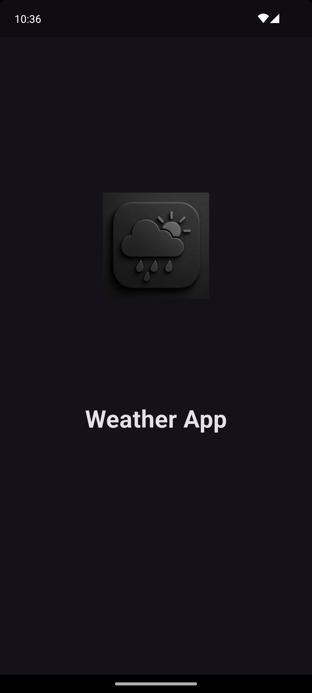
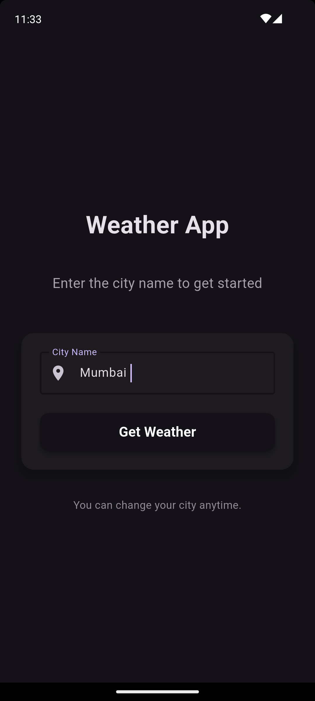
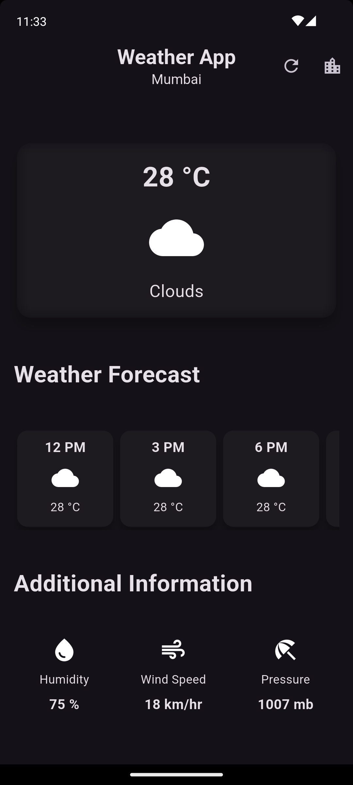

# Weather App 🌤️

A beautiful and intuitive Flutter weather application that provides real-time weather information for any city worldwide. Built with Material Design 3 and dark theme for a modern user experience.

## 📱 Demo

[](https://youtube.com/shorts/tHZVERkG7b4?feature=share)

## ✨ Features

### 🌟 Core Features

- **Real-time Weather Data**: Fetches current weather information using OpenWeather API
- **City Selection**: Easy city selection with persistent storage
- **Local Storage**: Remembers your selected city using SharedPreferences
- **Modern UI**: Beautiful dark theme with Material Design 3
- **Splash Screen**: Custom branded splash screen with app logo
- **Responsive Design**: Optimized for different screen sizes

### 📊 Weather Information Displayed

- **Current Temperature**: Real-time temperature with weather conditions
- **Humidity**: Current humidity percentage
- **Wind Speed**: Wind speed in appropriate units
- **Pressure**: Atmospheric pressure readings
- **Weather Conditions**: Descriptive weather status with icons
- **Additional Info**: Extended weather details for comprehensive information

### 💾 Smart Features

- **First-time Setup**: Intuitive city selection for new users
- **Data Persistence**: Saves your preferences locally
- **Easy City Change**: Quick city switching from the main screen
- **Offline Storage**: City preferences stored locally without internet dependency

## 📸 Screenshots

### Splash Screen



_Beautiful branded splash screen with dark theme_

### City Selection



_Clean and intuitive city selection interface_

### Weather Display



_Comprehensive weather information display_

## 🛠️ Technical Features

### 🏗️ Architecture

- **Flutter Framework**: Cross-platform mobile development
- **Material Design 3**: Modern UI components and theming
- **SharedPreferences**: Local data persistence
- **HTTP Requests**: RESTful API integration
- **State Management**: Efficient state handling with StatefulWidget

### 🔐 Security & Distribution

- **Signed APK**: Production-ready signed application
- **Internet Permissions**: Proper Android manifest configuration
- **Secure Storage**: Local data stored in app's private space

## 🚀 Getting Started

### Prerequisites

- Flutter SDK (3.32.8 or later)
- Dart SDK (3.8.1 or later)
- Android Studio or VS Code
- OpenWeather API key

### Installation

1. **Clone the repository**

```bash
git clone https://github.com/kunal7236/Weather-App.git
cd weather_app
```

2. **Install dependencies**

```bash
flutter pub get
```

3. **Setup API Key**

   - Get your free API key from [OpenWeather](https://openweathermap.org/api)
   - Open `lib/secret.dart`
   - Replace `YOUR_API_KEY` with your actual API key:

   ```dart
   const openWeatherAPIKey = 'your_actual_api_key_here';
   ```

4. **Run the application**

```bash
flutter run
```

### Building for Release

**Build APK:**

```bash
flutter build apk --release
```

**Build App Bundle (for Play Store):**

```bash
flutter build appbundle --release
```

## � Download APK

Ready to use? Download the pre-built APK files directly:

> 🔢 **Version Information**: All APK files include version `1.2.0` (build 3) embedded in both filename and app metadata for easy tracking and updates.

### 📱 Available APK Files

| APK File                       | Architecture | File Size | Device Compatibility           | Recommended Use                           |
| ------------------------------ | ------------ | --------- | ------------------------------ | ----------------------------------------- |
| **weather-app-v1.2.0-arm7.apk**       | ARM 32-bit   | 12.2 MB   | Most Android devices (2012+)   | ✅ **Best Choice** - Widest compatibility |
| **weather-app-v1.2.0-arm64.apk**      | ARM 64-bit   | 12.7 MB   | Modern Android devices (2014+) | 🔥 High performance devices               |
| **weather-app-v1.2.0-x64.apk**        | x86 64-bit   | 12.8 MB   | Intel-based Android devices    | 💻 Emulators & Intel tablets              |
| **weather-app-v1.2.0-universal.apk** | Universal    | 26.0 MB   | All Android devices            | 📦 Single file for all devices            |

### 🎯 Which APK Should You Choose?

#### 🌟 **Recommended: weather-app-v1.2.0-arm7.apk (12.2 MB)**

- **Best for most users** - Works on virtually all Android devices
- **Smallest file size** - Faster download and installation
- **Universal compatibility** - Supports both 32-bit and 64-bit ARM devices
- **Device coverage** - 95%+ of Android devices worldwide

#### ⚡ **For Modern Devices: weather-app-v1.2.0-arm64.apk (12.7 MB)**

- **Better performance** on 64-bit devices
- **Optimized** for newer Android phones (2014+)
- **Recommended if** your device is from 2014 or later

#### 💻 **For Intel Devices: weather-app-v1.2.0-x64.apk (12.8 MB)**

- **Specifically for** Intel-based Android devices
- **Android emulators** (BlueStacks, Android Studio)
- **Intel tablets** and specialized devices

#### 📦 **Universal Option: weather-app-v1.2.0-universal.apk (26.0 MB)**

- **One APK for all** device types
- **Larger file size** but guaranteed compatibility
- **Use if unsure** about your device architecture

### 🔍 How to Check Your Device Architecture

**Option 1: Use an App**

- Install "CPU-Z" or "AIDA64" from Play Store
- Check the "CPU" or "Hardware" section

**Option 2: Through Settings**

- Go to Settings → About Phone → Processor
- Look for "ARM", "ARM64", or "x86"

**Option 3: When in Doubt**

- Download **weather-app-v1.2.0-arm7.apk** - it works on 95% of devices!

### 📲 Installation Instructions

1. **Download** your chosen APK file
2. **Enable** "Install from Unknown Sources" in Android Settings
3. **Open** the downloaded APK file
4. **Tap** "Install" when prompted
5. **Launch** the Weather App and enjoy!

> 💡 **Pro Tip**: Start with `weather-app-v1.2.0-arm7.apk` - it's the smallest and most compatible option!

## �📱 Usage

1. **First Launch**: Select your city when prompted
2. **View Weather**: See comprehensive weather information
3. **Change City**: Tap the city name in the app bar to select a different city
4. **Automatic Updates**: Weather data updates when you open the app

## 📦 Dependencies

```yaml
dependencies:
  flutter:
    sdk: flutter
  http: ^1.1.2 # HTTP requests for API calls
  intl: ^0.19.0 # Date/time formatting
  shared_preferences: ^2.2.3 # Local data storage
  cupertino_icons: ^1.0.6 # iOS-style icons
```

## 🏃‍♂️ Development

### Project Structure

```
lib/
├── main.dart                    # App entry point
├── splash_screen.dart           # Branded splash screen
├── city_selection_screen.dart   # City selection interface
├── weather_screen.dart          # Main weather display
├── hourly_forecast_item.dart    # Hourly forecast component
├── additional_info_item.dart    # Additional info component
└── secret.dart                  # API key configuration
```

### Key Features Implementation

- **Persistent Storage**: SharedPreferences for city data
- **API Integration**: HTTP package for weather data
- **Navigation**: Flutter's navigation system
- **Theme**: Material Design 3 dark theme
- **Error Handling**: User-friendly error messages

## 🔧 Configuration

### Android Permissions

The app includes necessary permissions in `AndroidManifest.xml`:

- `INTERNET`: For weather API calls

### Signing Configuration

The app is configured for release signing with:

- Custom keystore for security
- Production-ready APK generation
- No security warnings during installation

## 🤝 Contributing

1. Fork the repository
2. Create your feature branch (`git checkout -b feature/AmazingFeature`)
3. Commit your changes (`git commit -m 'Add some AmazingFeature'`)
4. Push to the branch (`git push origin feature/AmazingFeature`)
5. Open a Pull Request

## 📄 License

This project is licensed under the MIT License - see the [LICENSE](LICENSE) file for details.

## 👨‍💻 Author

**Kunal Kashyap**

- GitHub: [@kunal7236](https://github.com/kunal7236)
- Repository: [Weather-App](https://github.com/kunal7236/Weather-App)

## 🙏 Acknowledgments

- [OpenWeather API](https://openweathermap.org/) for weather data
- [Flutter](https://flutter.dev/) for the amazing framework
- [Material Design](https://material.io/) for design guidelines

---

⭐ Star this repository if you found it helpful!
